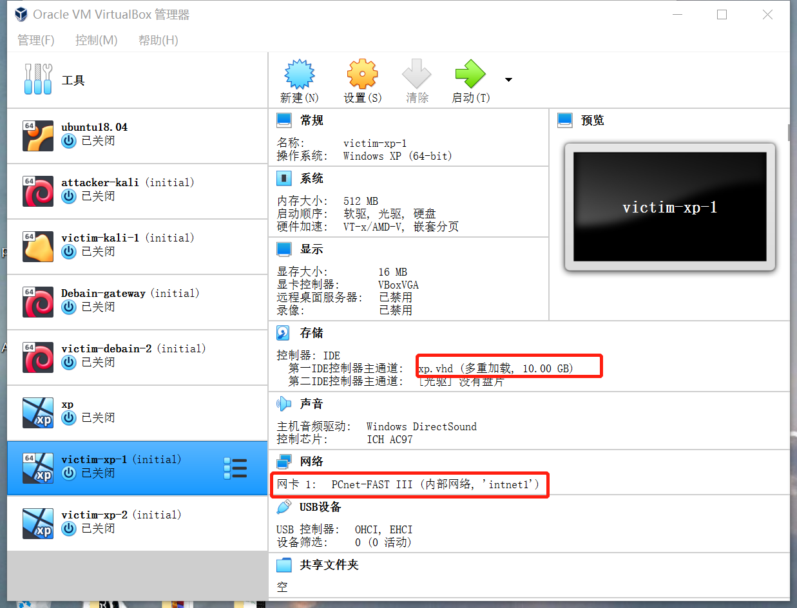
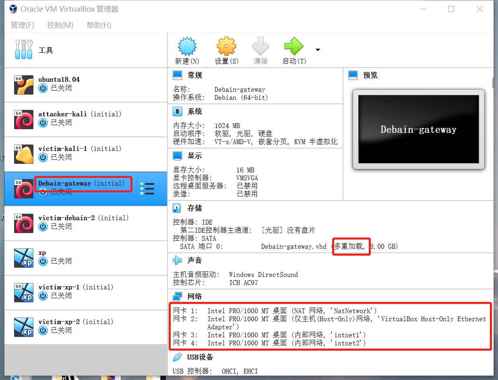
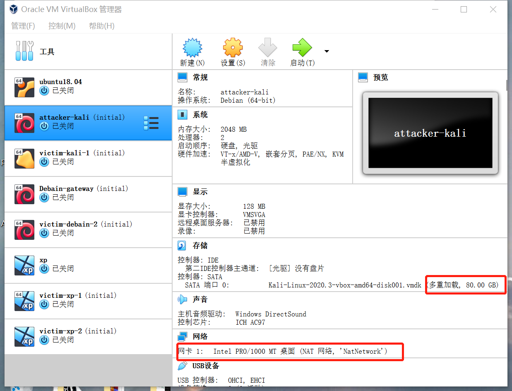

# 基于 VirtualBox 的网络攻防基础环境搭建
## 实验目的
- 掌握 VirtualBox 虚拟机的安装与使用；
- 掌握 VirtualBox 的虚拟网络类型和按需配置；
- 掌握 VirtualBox 的虚拟硬盘多重加载；
## 实验环境
- VirtualBox 虚拟机
- 攻击者主机（Attacker）：Kali Rolling 2109.2
- 网关（Gateway, GW）：Debian Buster
- 靶机（Victim）：From Sqli to shell / xp-sp3 / Kali
## 实验要求
- 虚拟硬盘配置成多重加载（如下图所示）；
- 搭建满足如下拓扑图所示的虚拟机网络拓扑（如下图所示）；



- 在网关修改网络配置文件```vi /etc/network/interfaces```,复制相关代码到文件中之后重启网络服务
- 安装并配置dnsmasq，修改```vi /etc/dnsmasq.conf```后进入/etc/dnsmasq.d文件中新建gw-enp0s9.conf和gw-enp0s10.conf并写入相关代码
- xp需要关闭网络防火墙才能ping通
### 虚拟机对应IP地址
| 机器 | IP |
| - | - |
| victim-kali | 172.16.111.120 |
| gateway | 172.16.111.1/172.16.222.1/10.0.2.4/192.168.56.103 |
| attacker | 10.0.2.15 |
| victim-xp-1 | 172.16.111.101 |
| victim-xp-2 | 172.16.222.129 |
| victim-debian | 172.16.222.141 |
## 完成以下网络连通性测试
- [x] 靶机可以直接访问攻击者主机


--------------
- [x] 攻击者主机无法直接访问靶机


--------------
- [x] 网关可以直接访问攻击者主机和靶机


-----------------------
- [x] 靶机的所有对外上下行流量必须经过网关
- [x] 所有节点均可以访问互联网


-------------
## 参考文献
- [参考师哥师姐作业](https://github.com/CUCCS/2019-NS-Public-Liuxxx3/blob/chap_1/chap_01/%E5%9F%BA%E4%BA%8E%20VirtualBox%20%E7%9A%84%E7%BD%91%E7%BB%9C%E6%94%BB%E9%98%B2%E5%9F%BA%E7%A1%80%E7%8E%AF%E5%A2%83%E6%90%AD%E5%BB%BA.md)
- [解决Debian使用ip addr查不到ip地址的问题](https://blog.csdn.net/qq_41904729/article/details/107095648)
- [vi命令复习](http://www.ldzgr.com/archives/301)
## 备注：其他事例图片在img文件中查看