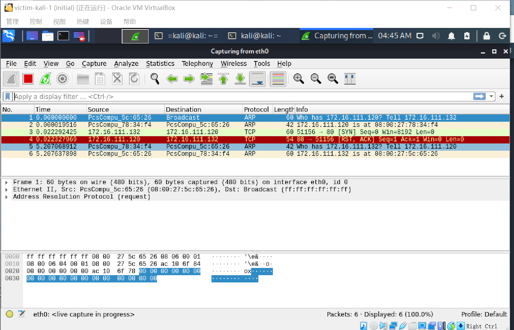

# 基于 Scapy 编写端口扫描器
## 实验目的
- 掌握网络扫描之端口状态探测的基本原理
## 实验环境
- python + scapy
- attacker-kali：172.16.111.132
- victim-kali:172.16.111.120
- debian-gateway:172.16.111.1
## 实验要求
- 禁止探测互联网上的 IP ，严格遵守网络安全相关法律法规
- 完成以下扫描技术的编程实现
- [x] TCP connect scan / TCP stealth scan
- [x] TCP Xmas scan / TCP fin scan / TCP null scan
- [x] UDP scan
- 上述每种扫描技术的实现测试均需要测试端口状态为：开放、关闭 和 过滤 状态时的程序执行结果
- 提供每一次扫描测试的抓包结果并分析与课本中的扫描方法原理是否相符？如果不同，试分析原因；
- 在实验报告中详细说明实验网络环境拓扑、被测试 IP 的端口状态是如何模拟的
- （可选）复刻 nmap 的上述扫描技术实现的命令行参数开关

## 实验步骤
- 搭建网络环境
1. 网络设置：


- ip地址


- 网络连通性测试


### 代码实现：
- TCP connect scan

- TCP stealth scan

- TCP Xmas scan

-  TCP fin scan

-  TCP null scan

-  UDP scan

 
### 抓包过程
- TCP connect scan
> 如果接收到的是一个 SYN/ACK 数据包，则说明端口是开放状态的；如果接收到的是一个 RST/ACK 数据包，通常意味着端口是关闭的并且链接将会被重置；如果目标主机没有任何响应则意味着目标主机的端口处于过滤状态

1. 端口状态为`关闭`时
- attacker运行Determine_port.py
- 利用wireshark分析抓包结果
- attacker给victim的80端口发送了设置SYN标志的TCP包，victim发送给attacker的返回包中设置了RST标志


2. 端口状态`开启`时
- attacker运行Determine_port.py
- 利用wireshark分析抓包结果
- attacker和victim之间进行了完整的3次握手TCP通信，并且该连接由attacker在最终握手中发送确认ACK+RST标志来建立


3. 端口状态为`过滤`时
- attacker运行Determine_port.py
- 利用wireshark分析抓包结果
- attacker给victim的80端口发送设置SYN标志的TCP包，victim不返回TCP数据包给attacker而返回了ICMP数据包，且类型为type3

----------------
- TCP stealth scan
> 类似于TCP连接扫描。但是最后在TCP数据包中发送的是RST标志而不是RST + ACK。

1. 端口状态为`关闭`时
- attacker运行stealth_scan.py
- 利用wireshark分析抓包结果
- attacker给victim的80端口发送了设置SYN标志的TCP包，victim发送给attacker的返回包中设置了RST标志


1. 端口状态`开启`时
- attacker运行stealth_scan.py
- 利用wireshark分析抓包结果
- attacker和victim之间进行了完整的3次握手TCP通信，并且该连接由attacker在最终握手中发送确认RST标志来建立


1. 端口状态为`过滤`时
- attacker运行stealth_scan.py
- 利用wireshark分析抓包结果
- attacker给victim的80端口发送设置SYN标志的TCP包，victim不返回TCP数据包给attacker而返回了ICMP数据包，且类型为type3


----------------
- TCP Xmas scan
> Xmas发送一个TCP包，并对TCP报文头FIN、URG和PUSH标记进行设置。若是关闭的端口则响应 RST 报文；开放或过滤状态下的端口则无任何响应

1. 端口状态为`关闭`时
- attacker运行Xmas_scan.py
- 利用wireshark分析抓包结果
- attacker给victim的80端口发送了PSH，FIN和URG标志的TCP包，victim发送给attacker的返回包中设置了RST标志


1. 端口状态`开启`时
- attacker运行Xmas_scan.py
- 利用wireshark分析抓包结果
- attacker给victim的80端口发送了设置PSH、FIN和URG标志的TCP数据包，victim没有发送TCP包响应，无法区分其80端口开启/过滤；但是victim也没有发送ICMP数据包给attacker，说明端口不是过滤状态


1. 端口状态为`过滤`时
- attacker运行Xmas_scan.py
- 利用wireshark分析抓包结果
- attacker给victim的80端口发送设置了PSH，FIN和URG标志的TCP包，victim返回ICMP数据包给attacker且类型为type3


----------------
- TCP fin scan
1. 端口状态为`关闭`时
- attacker运行fin_scan.py
- 利用wireshark分析抓包结果
- attacker给victim的80端口发送了FIN标志的TCP包，victim发送给attacker的返回包中设置了RST标志


1. 端口状态`开启`时
- attacker运行fin_scan.py
- 利用wireshark分析抓包结果
- attacker给victim的80端口发送了设置FIN标志的TCP数据包，victim没有发送TCP包响应，无法区分其80端口开启/过滤；但是victim也没有发送ICMP数据包给attacker，说明端口不是过滤状态


1. 端口状态为`过滤`时
- attacker运行fin_scan.py
- 利用wireshark分析抓包结果
- attacker给victim的80端口发送设置了FIN标志的TCP包，victim返回ICMP数据包给attacker且类型为type3


----------------
-  TCP null scan
1. 端口状态为`关闭`时
- attacker运行null_scan.py
- 利用wireshark分析抓包结果
- attacker给victim的80端口发送了没有任何标志的TCP包，victim发送给attacker的返回包中设置了RST标志


1. 端口状态`开启`时
- attacker运行null_scan.py
- 利用wireshark分析抓包结果
- attacker给victim的80端口发送了设置没有任何标志的TCP数据包，victim没有发送TCP包响应，无法区分其80端口开启/过滤；但是victim也没有发送ICMP数据包给attacker，说明端口不是过滤状态


1. 端口状态为`过滤`时
- attacker运行null_scan.py
- 利用wireshark分析抓包结果
- attacker给victim的80端口发送设置了没有任何标志的TCP包，victim返回ICMP数据包给attacker且类型为type3


----------------
- UDP scan

1. 端口状态为`关闭`时
- attacker运行udp_scan.py
- 利用wireshark分析抓包结果
- attacker给victim的80端口发送了UDP数据包，victim响应ICMP端口不可达错误type3和code3


1. 端口状态`开启`时
- attacker运行udp_scan.py
- 利用wireshark分析抓包结果
- attacker给victim的80端口发送了UDP数据包，victim没响应ipv4包


1. 端口状态为`过滤`时
- attacker运行udp_scan.py
- 利用wireshark分析抓包结果

----------------

## 实验补充(遇到的困难)
1. 端口扫描：
- ```netstat -anp```查看端口状态
- ```nc -lp 80 &```TCP开启80端口

- ```nc -u -l -p 80 < /etc/passwd```UDP开启80端口

- ```iptables -A INPUT -p tcp -m tcp --dport 80 -j REJECT```设置端口被防火墙过滤


## 复刻 nmap 的上述扫描技术实现的命令行参数开关
1. TCP connect scan
```nmap 172.16.111.120 -p 80 -sT -n -T4 -vv```
2. TCP stealth scan
```nmap 172.16.111.120 -p 80 -sS -n -T4 -vv```
3. TCP Xmas scan
```nmap 172.16.111.120 -p 80 -sX -n -T4 -vv```
4. TCP fin scan
```nmap 172.16.111.120 -p 80 -sF -n -T4 -vv```
5. TCP null scan
```nmap 172.16.111.120 -p 80 -sN -n -T4 -vv```
6. UDP scan
```nmap 172.16.111.120 -p 80 -sU -n -T4 -vv```

## 参考资料
- [打开端口](https://blog.csdn.net/weixin_37264997/article/details/80329786?utm_medium=distribute.pc_relevant_t0.none-task-blog-OPENSEARCH-1.nonecase&depth_1-utm_source=distribute.pc_relevant_t0.none-task-blog-OPENSEARCH-1.nonecase)
- [打开端口](https://blog.csdn.net/qq_37139220/article/details/107997865)
- [配置python3开发环境](https://www.cnblogs.com/mwq1024/p/10704279.html)
- [参考作业1](https://github.com/CUCCS/2019-NS-Public-Great-Lin999/blob/ns-chap0x05/ns-chap0x05/%E5%9F%BA%E4%BA%8E%20Scapy%20%E7%BC%96%E5%86%99%E7%AB%AF%E5%8F%A3%E6%89%AB%E6%8F%8F%E5%99%A8.md)
- [参考作业2](https://github.com/CUCCS/2019-NS-Public-mly3006/tree/0x05)
- [参考作业3](https://github.com/CUCCS/2019-NS-Public-cjx2017/blob/ns-chap0x05/ns-chap0x05/%E5%9F%BA%E4%BA%8E%20Scapy%20%E7%BC%96%E5%86%99%E7%AB%AF%E5%8F%A3%E6%89%AB%E6%8F%8F%E5%99%A8.md#1tcp-connect-scan-1)
- [代码参考](https://www.cnblogs.com/linagcheng/archive/2004/01/13/13033631.html)
- [配置python3](https://www.cnblogs.com/mwq1024/p/10704279.html)