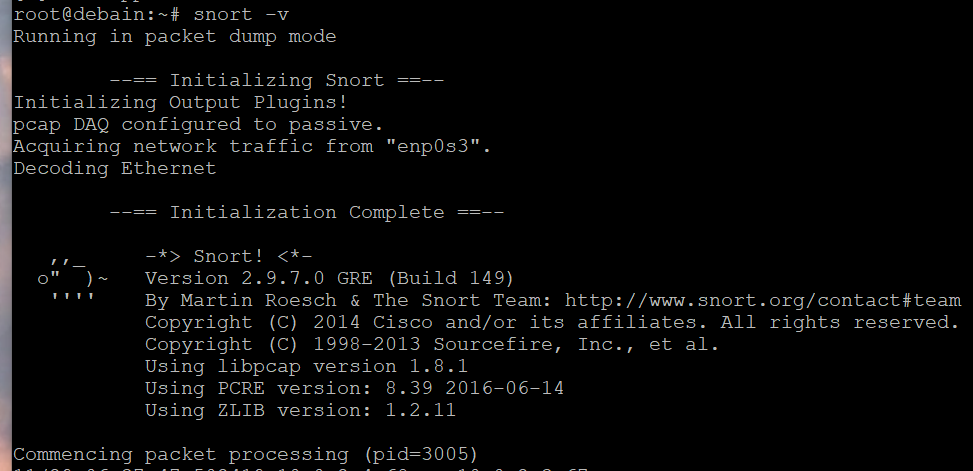
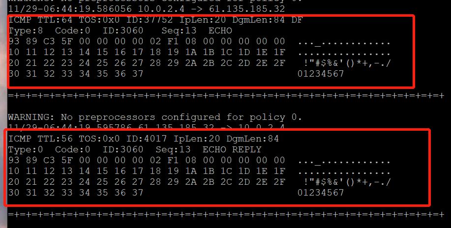

# Snort
-------------------
## 实验目的
- 进行入侵检测的软件实现体验，以工具`snort`为主
---------------------
## 实验要求
- 通过配置`snort`不同规则来进行网络入侵检测
---------------------
## 实验环境
- 两台debian主机，可互通（192.168.56.108和192.168.56.103）


- 工具：snort、guardian、nmap
---------------------
## 实验过程
### 实验一 配置snort为嗅探模式
#### 实验准备
- 添加网络配置

#### 安装snort
```
# 禁止在apt安装时弹出交互式配置界面
export DEBIAN_FRONTEND=noninteractive
apt install snort
```
#### 配置过程和结果

```
# 显示IP/TCP/UDP/ICMP头
snort –v
```

```
显示ICMP头
```

```
# 显示应用层数据
snort -vd
```

- 将嗅探的数据保存下来`snort -q -v -b -i enp0s8 "port not 22"`

```
# -b 参数表示报文存储格式为 tcpdump 格式文件
# -q 静默操作，不显示版本欢迎信息和初始化信息
snort -q -v -b -i eth1 "port not 22"
# 使用 CTRL-C 退出嗅探模式
# 嗅探到的数据包会保存在 /var/log/snort/snort.log.<epoch timestamp>
# 其中<epoch timestamp>为抓包开始时间的UNIX Epoch Time格式串
# 可以通过命令 date -d @<epoch timestamp> 转换时间为人类可读格式
# exampel: date -d @1511870195 转换时间为人类可读格式
# 上述命令用tshark等价实现如下：
tshark -i eth1 -f "port not 22" -w 1_tshark.pcap
```
---------------------
### 实验二 配置并启用snort内置规则
```
# /etc/snort/snort.conf 中的 HOME_NET 和 EXTERNAL_NET 需要正确定义
# 例如，学习实验目的，可以将上述两个变量值均设置为 any
snort -q -A console -b -i eth1 -c /etc/snort/snort.conf -l /var/log/snort/
```

```
# 启用内置规则
snort -q -A console -b -i enp0s3 -c /etc/snort/snort.conf -l /var/log/snort/
```


---------------------

### 实验三 自定义snort规则
```
# 新建自定义 snort 规则文件
cat << EOF > /etc/snort/rules/cnss.rules
alert tcp \$EXTERNAL_NET any -> \$HTTP_SERVERS 80 (msg:"Access Violation has been detected on /etc/passwd ";flags: A+; content:"/etc/passwd"; nocase;sid:1000001; rev:1;)
alert tcp \$EXTERNAL_NET any -> \$HTTP_SERVERS 80 (msg:"Possible too many connections toward my http server"; threshold:type threshold, track by_src, count 100, seconds 2; classtype:attempted-dos; sid:1000002; rev:1;)
EOF
```

```
# 添加配置代码到 /etc/snort/snort.conf
include $RULE_PATH/cnss.rules
```

```
# 启动
snort -q -A console -b -i enp0s3 -c /etc/snort/snort.conf -l /var/log/snort/
```


---------------------

### 实验四 和防火墙联动
```
# 下载guardian，并运行snort
# 下载压缩包并用psftp传入虚拟机


# 解压缩 Guardian-1.7.tar.gz
tar zxf guardian.tar.gz

# 安装 Guardian 的依赖 lib
apt install libperl4-corelibs-perl

# 开启 snort
snort -q -A fast -b -i eth1 -c /etc/snort/snort.conf -l /var/log/snort/
```

```
# 配置guardian并运行
# 编辑 guardian.conf 并保存，确认以下2个参数的配置符合主机的实际环境参数。

HostIpAddr      192.168.56.108
Interface       enp0s8
```

```
# 启动 guardian.pl
perl guardian.pl -c guardian.conf
```

```
# 另一台主机用nmap扫描
nmap 10.0.2.15 -A -T4 -n -vv
```

```
guardian.conf 中默认的来源IP被屏蔽时间是 60 秒（屏蔽期间如果黑名单上的来源IP再次触发snort报警消息，则屏蔽时间会继续累加60秒）

root@KaliRolling:~/guardian# iptables -L -n
Chain INPUT (policy ACCEPT)
target     prot opt source               destination
REJECT     tcp  --  10.0.2.6       0.0.0.0/0            reject-with tcp-reset
DROP       all  --  10.0.2.6       0.0.0.0/0

Chain FORWARD (policy ACCEPT)
target     prot opt source               destination

Chain OUTPUT (policy ACCEPT)
target     prot opt source               destination

# 1分钟后，guardian.pl 会删除刚才添加的2条 iptables 规则
root@KaliRolling:~/guardian# iptables -L -n
Chain INPUT (policy ACCEPT)
target     prot opt source               destination

Chain FORWARD (policy ACCEPT)
target     prot opt source               destination

Chain OUTPUT (policy ACCEPT)
target     prot opt source               destination
```
---------------------
### 实验遇到的问题
- 1、apt不能安装snort：对apt-get进行更新修复
```
cd /var/lib/dpkg/
sudo mv info/ info_bak          # 现将info文件夹更名
sudo mkdir info                 # 再新建一个新的info文件夹
sudo apt-get update             # 更新
sudo apt-get -f install         # 修复
sudo mv info/* info_bak/        # 执行完上一步操作后会在新的info文件夹下生成一些文件，现将这些文件全部移到info_bak文件夹下
sudo rm -rf info                # 把自己新建的info文件夹删掉
sudo mv info_bak info           # 把以前的info文件夹重新改回名
```
- 无法获得锁：应该是上一个apt进程还在运行，必须要解锁才能再apt：
```
sudo rm /var/lib/apt/lists/lock
```
- 无法执行`snort -v`:su -切换到root用户即可

### 附录
- [无法获得锁](https://blog.csdn.net/voke_/article/details/78656383)
- [apt无法进行安装](https://blog.csdn.net/wanttifa/article/details/107548931)
- [参考实验1](https://github.com/CUCCS/2019-NS-Public-chencwx/blob/ns_chap0x09/ns_chapter9/%E5%85%A5%E4%BE%B5%E6%A3%80%E6%B5%8B.md)
- [参考实验2](https://github.com/CUCCS/2020-ns-public-LLLanW/blob/exp09/exp09.md)