# 常见蜜罐体验和探索
## 实验目的
- 了解蜜罐的分类和基本原理
- 了解不同类型蜜罐的适用场合
- 掌握常见蜜罐的搭建和使用
## 实验环境
- 从paralax/awesome-honeypots中选择 1 种低交互蜜罐和 1 种中等交互蜜罐进行搭建实验

## 实验要求
- [x] 记录蜜罐的详细搭建过程；
- [x] 使用 nmap 扫描搭建好的蜜罐并分析扫描结果，同时分析「 nmap 扫描期间」蜜罐上记录得到的信息；
- [x] 如何辨别当前目标是一个「蜜罐」？以自己搭建的蜜罐为例进行说明；
- [x] （可选）总结常见的蜜罐识别和检测方法；
- [x] （可选）基于 canarytokens 搭建蜜信实验环境进行自由探索型实验；(只写了一半)

## 实验过程
- 检查两台主机连通性
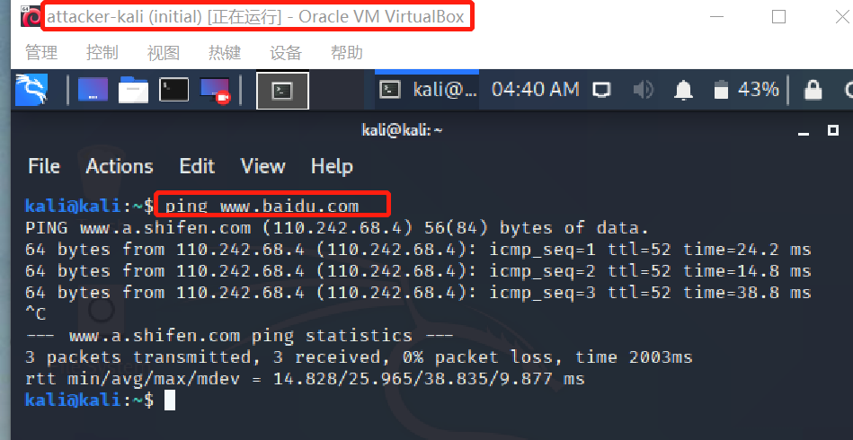
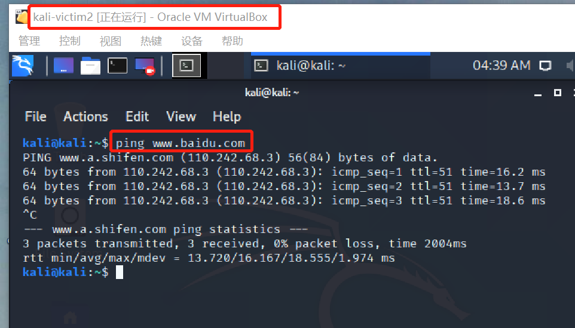
- 接下来的实验在```victim```中搭建蜜罐，```attacker```中模仿攻击者去攻击伪victim
### ssh-Honeypot
- 是一种极低交互式的简易蜜罐
- 在```victim```中安装docker容器
- 添加docker-ce的apt 源
```
apt-get update
apt-get install -y apt-transport-https ca-certificates curl software-properties-common
curl -fsSL https://download.daocloud.io/docker/linux/ubuntu/gpg | sudo apt-key add -
```
- 添加docker需要的密钥
```
curl -fsSL https://download.docker.com/linux/debian/gpg | sudo apt-key add -
```
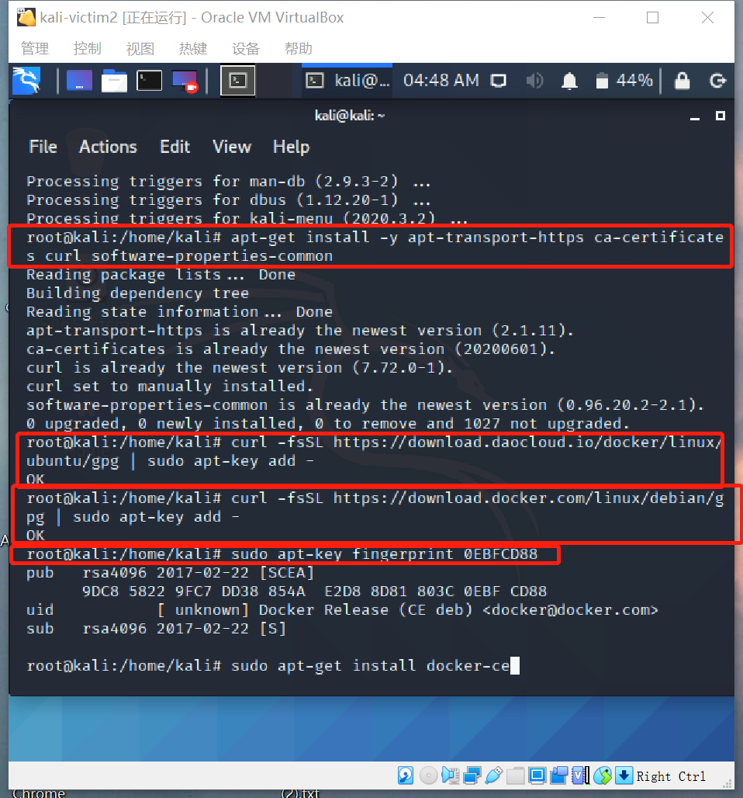
- 验证密钥的可用性并进行docker-ce的安装
```
sudo apt-key fingerprint 0EBFCD88
sudo apt-get update
sudo apt-get install docker-ce# 安装 Docker
```
- 开启docker服务并测试是否安装成功
```
systemctl start docker
sudo docker run helloworld
```
- 使用```docker image```指令查看镜像
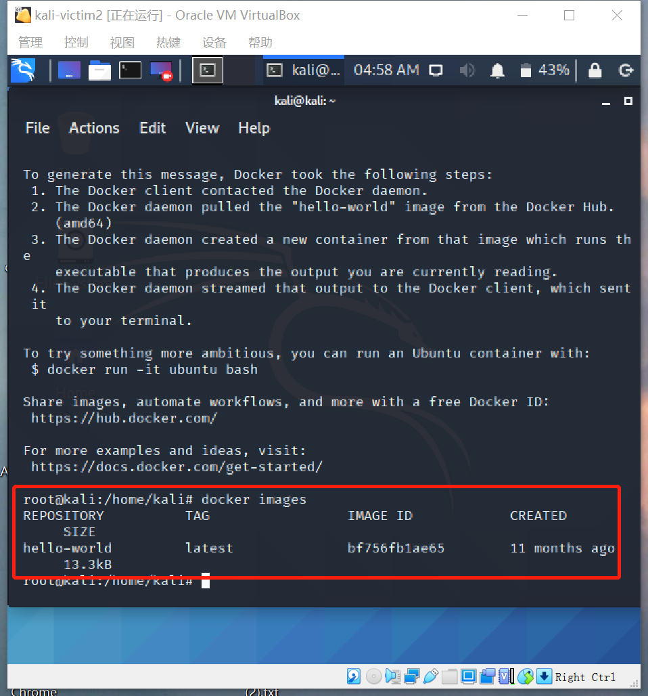
- 安装ssh-honeypot，首先确保libssh&libjson-c已经安装
```
apt install libssh-dev libjson-c-dev
```
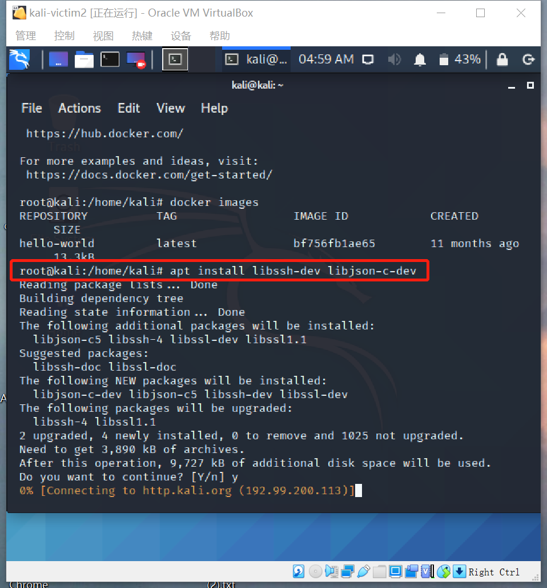
- 安装ssh，暂时先不设置密码(截图是设置了密码的，是之前做错的，后面改了之后忘了截图了)
```
make
ssh-keygen -t rsa -f ./ssh-honeypot.rsa
```
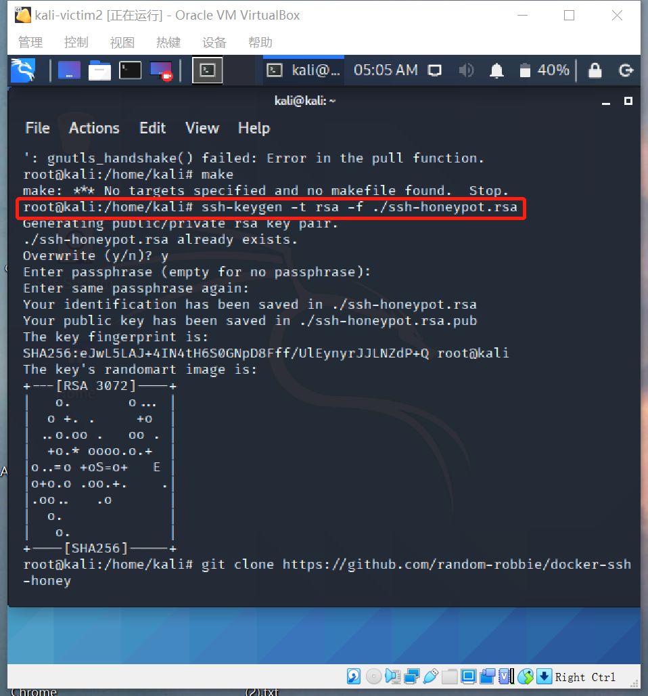
- 接下来安装docker-ssh-honeypot
```
git clone https://github.com/random-robbie/docker-ssh-honey
docker build . -t local:ssh-honeypot#构建镜像
docker run -p 2234:22 local:ssh-honeypot# 运行镜像 格式为本地端口:容器端口 
docker ps #获得id
docker exec -i -t id bash #进入容器
tail -F ssh-honeypot.log#查看日志
```
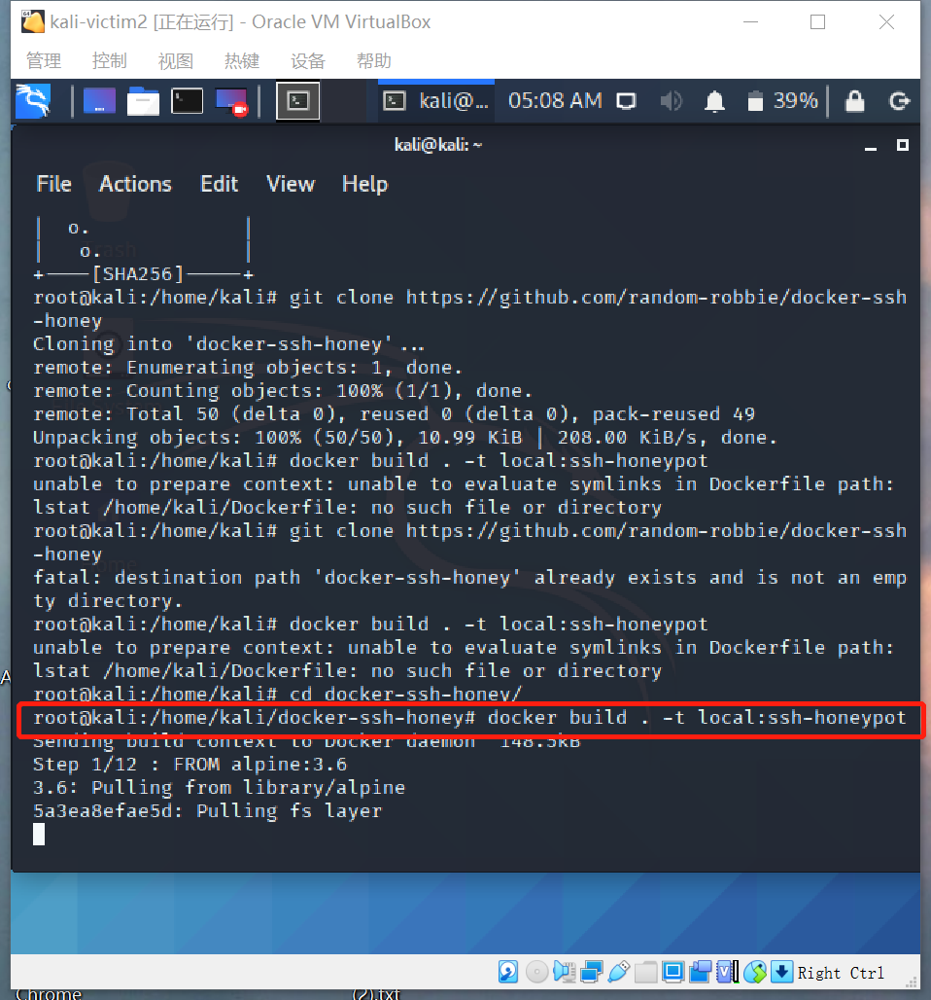
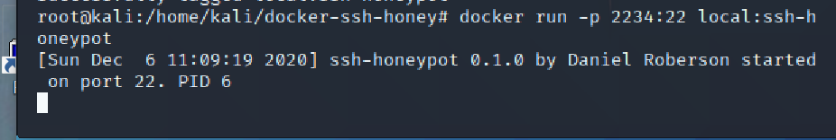
- 通过```docker ps```查看容器的id,这样才能进入容器
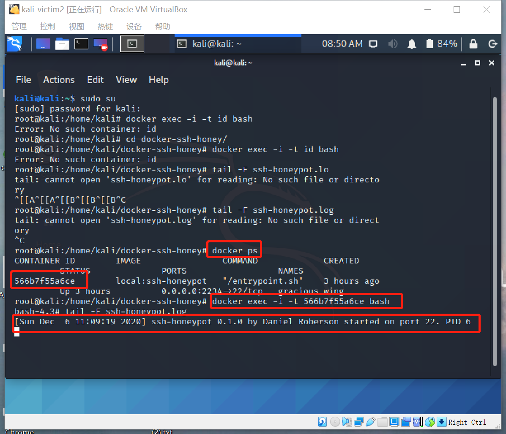
- 可以进行查看日志，这样即可看到攻击者的行为(下图为攻击者登录的记录)
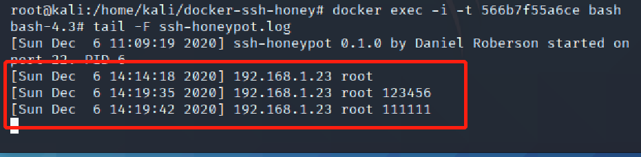
- 接下来让```attacker```对蜜罐所在主机端口进行ssh连接，进行观察，发现安装蜜罐的主机日志已经把该行为记录下来了
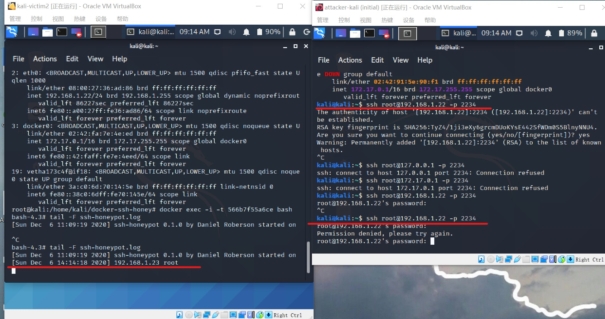
- 再次多次连接，发现无论输什么密码，连接都会被拒绝，原因是ssh-honeypot是一个低交互式的蜜罐，无法完成这些功能，但是日志能记录下所有攻击者的行为
- 另外，仔细查看日志信息，我们发现攻击者的所有行为都被记录下来了，包括输入的密码等等，以及攻击者的ip也展露无遗，这达到了蜜罐的初步目标，即收集对方的信息(即上面图片记录的攻击者信息)
- 接着attacker对目标主机进行nmap端口扫描，我们发现日志信息中并没有记录下，说明该蜜罐并未对此生效，也再一次说明了该蜜罐的低交互式，只是一个可以简单记录ssh连接的简易蜜罐
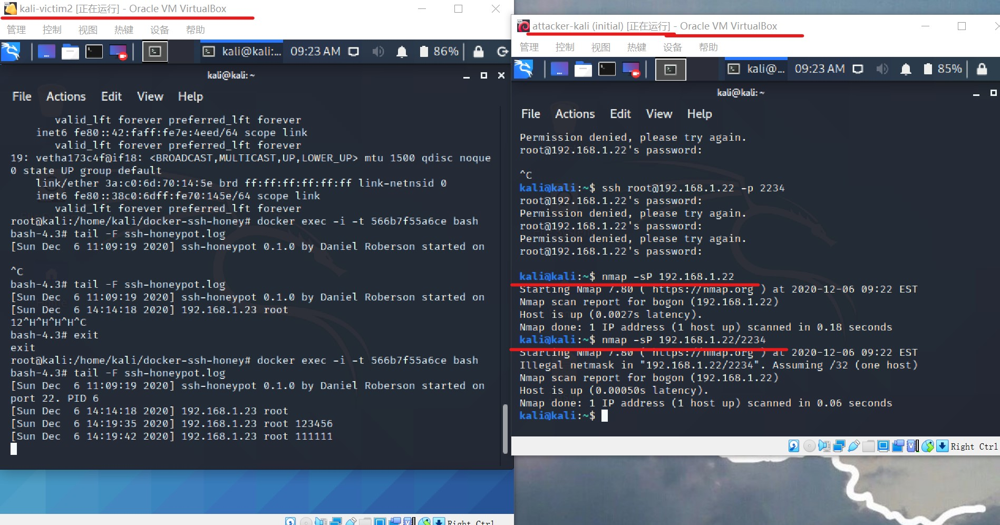

### Cowrie
- Cowrie是一种中到高交互性的SSH和Telnet蜜罐，旨在记录暴力攻击和攻击者执行的shell交互。在中等交互模式（shell）下，它以Python仿真UNIX系统；在高级交互模式（代理）下，它充当SSH和telnet代理，以观察攻击者对另一个系统的行为。
- Cowrie选择以仿真外壳运行（默认）：具有添加/删除文件功能的伪造文件系统。包含类似于Debian 5.0安装的完整伪造文件系统可能添加伪造的文件内容，以便攻击者可以监视/ etc / passwd等文件。仅包含最少的文件内容Cowrie保存使用wget / curl下载的文件或通过SFTP和scp上传的文件，以供以后检查；或将SSH和telnet代理到另一个系统:作为具有监控功能的纯telnet和ssh代理运行或者让Cowrie管理Qemu虚拟服务器池以提供登录到的系统
- 在docker中安装Cowrie
```
docker pull cowrie/cowrie
```
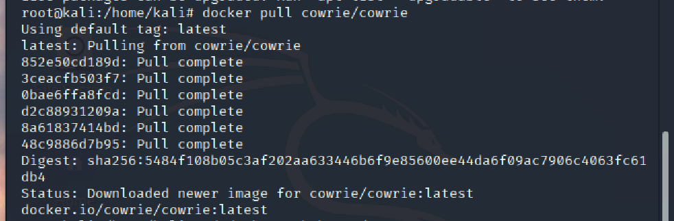
- 启动cowrie，在端口2222开启，同时在attacker中进行ssh连接攻击者，先使用正确的（其实说不上正确，毕竟本来就是伪造的）密码登录，发现日志信息已经记录下了所有行为
```
docker run -p 2222:2222 cowrie/cowrie
```
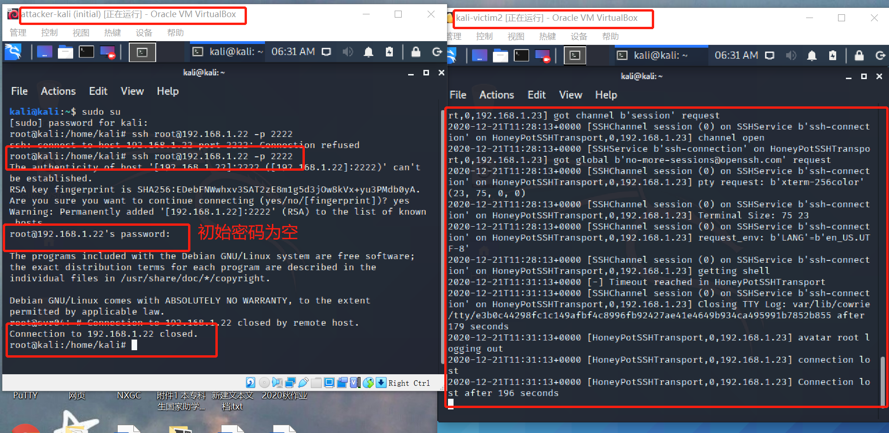
- 使用普通用户，发现在输入多次密码后被拒绝连接，猜想该蜜罐设置了不允许非root用户连接
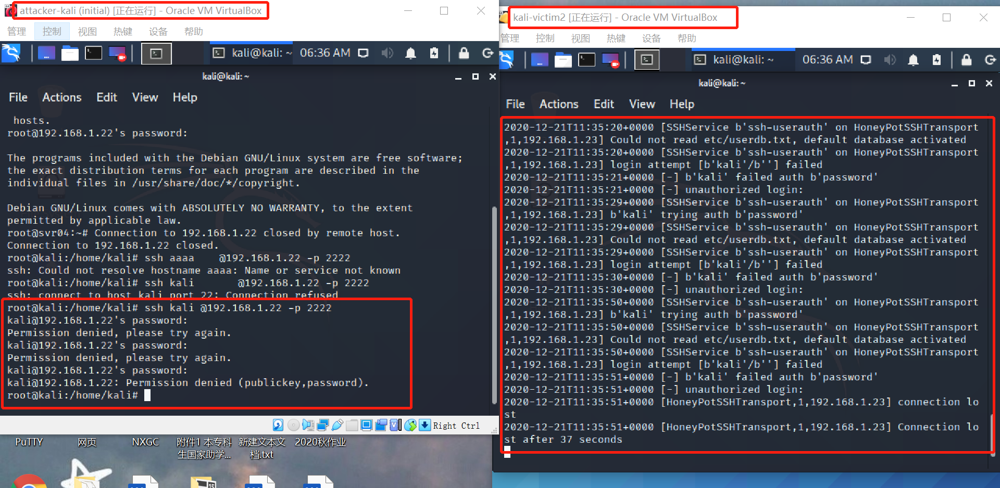
- 对于root用户，我们继续使用任意密码登录，我们会发现，输任意密码都可以登录，这也是该蜜罐的特点之一。由此可见，蜜罐的安全性必须保证，否则攻击者输入的是一段恶意代码，很有可能最后蜜罐反被当成“肉机”
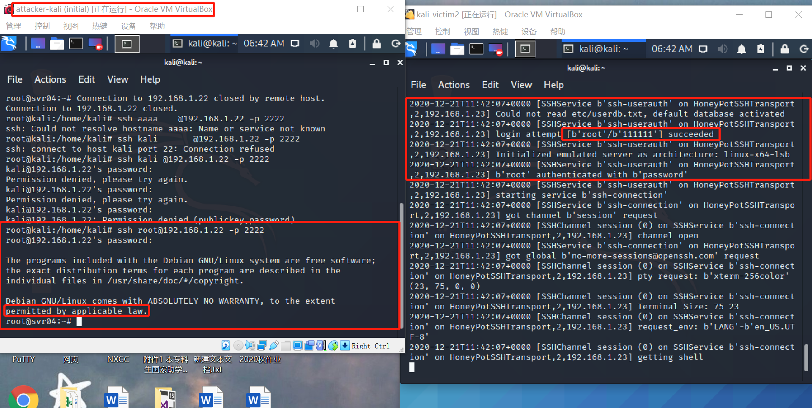
- ssh连接会自动断开，说明该蜜罐有设置连接时间限制，可能也是出于自我保护
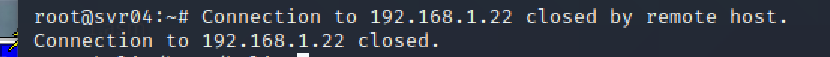
- 接着查看一下cowrie的日志文件，先进入容器，并查看日志所在目录，查看日志文件，需要注意的是，该蜜罐的日志文件是json文件，在日志中，我们可以看到刚刚的attacker连接的时间，ip等等信息
```
docker ps #查看id
docker exec -i -t container_id bash #进入容器
tail cowrie.json #查看日志
```
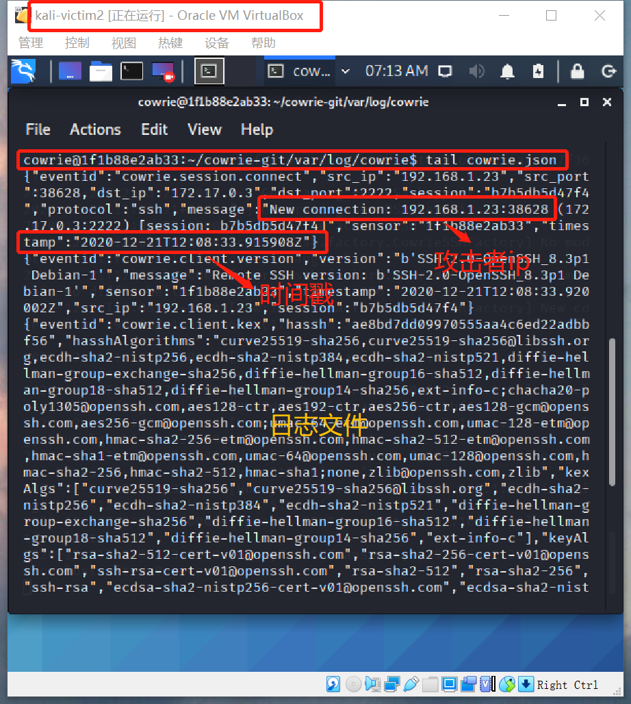
- 接下来在ssh连接的状态下，攻击者进行基本的连通性测试操作，发现ping和curl指令都正常运行了
```
ping www.baidu.com #ping百度
curl http://www.baidu.com/helloworld
```
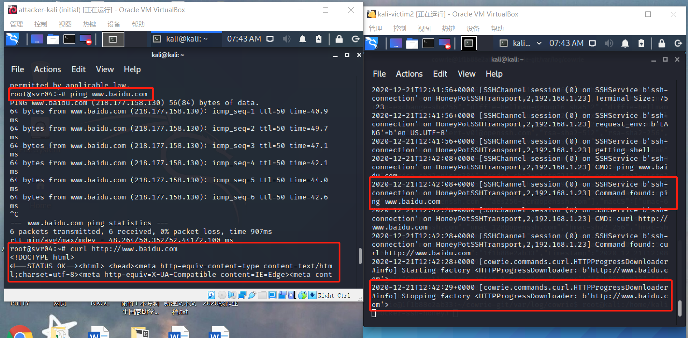
- 执行apt-get指令进行上次实验中snort包的下载,但是发现不能使用
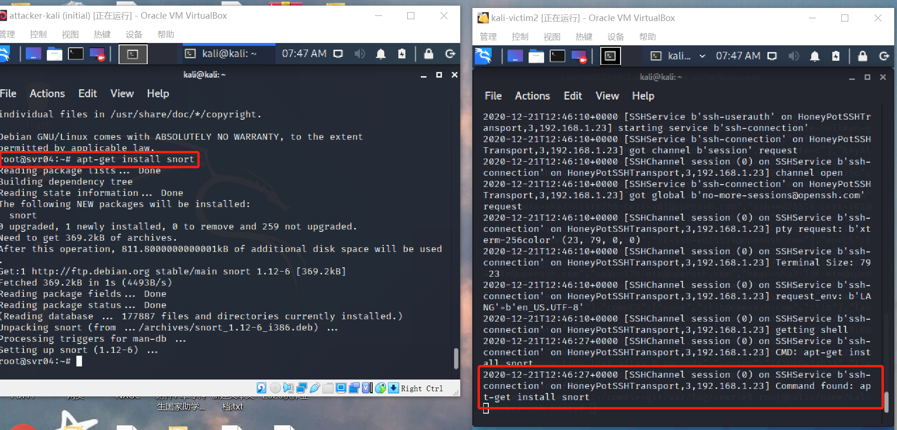
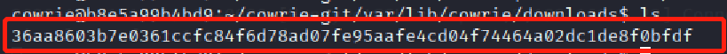
- 尝试对“靶机”进行nmap扫描，发现日志中居然也没有记录下这个信息，这个蜜罐也还是不太完善，但已经算是较高交互式的了，扫描的状态结果是开放，而service居然是EthernetIp-1，这显然不符合常理，通过这里也暴露出了蜜罐的存在
```
nmap -sX -p 2222 -n -vv 192.168.1.22
```
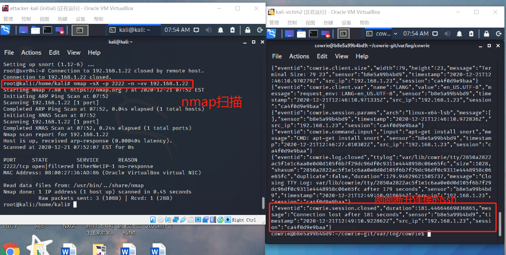
- 查看cowrie的配置文件
```
NOTE: untested

* Copy the file `docs/systemd/system/cowrie.socket` to `/etc/systemd/system`

* Copy the file `docs/systemd/system/cowrie.service` to `/etc/systemd/system`

* Examine `/etc/systemd/system/cowrie.service` and ensure the paths are correct for your installation if you use non-standard file system locations.

* Add entries to `etc/cowrie.cfg` to listen on ports via systemd. These must match your cowrie.socket configuration:

    [ssh]
    listen_endpoints = systemd:domain=INET6:index=0

    [telnet]
    listen_endpoints = systemd:domain=INET6:index=1

* Run:
    sudo systemctl daemon-reload
    sudo systemctl start cowrie.service
    sudo systemctl enable cowrie.service
```

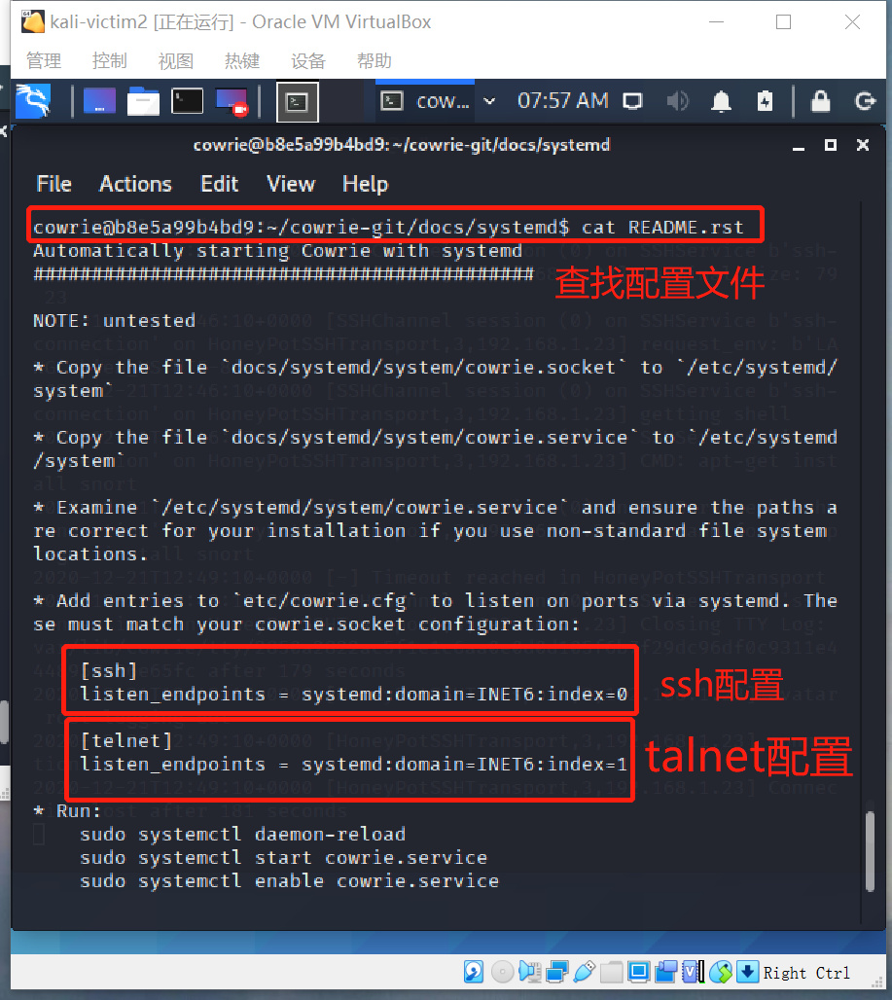
- 蜜罐支持的命令
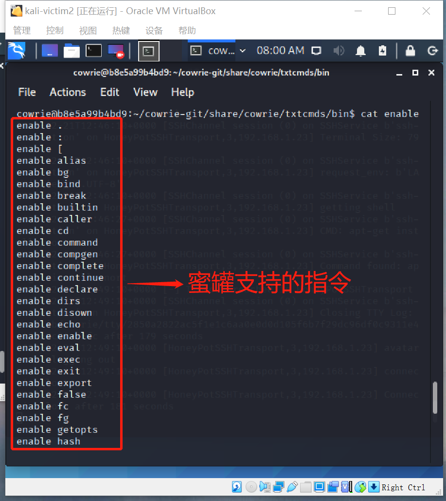

- 查看文件分区
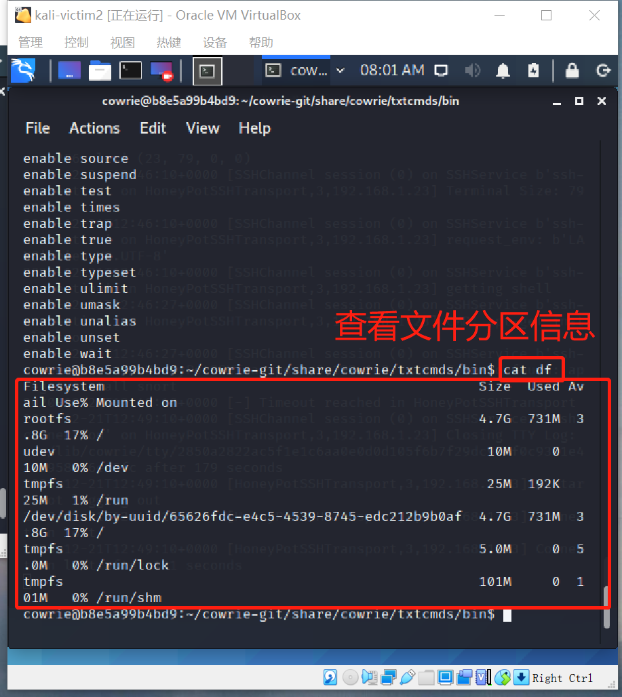

- 查看错误信息
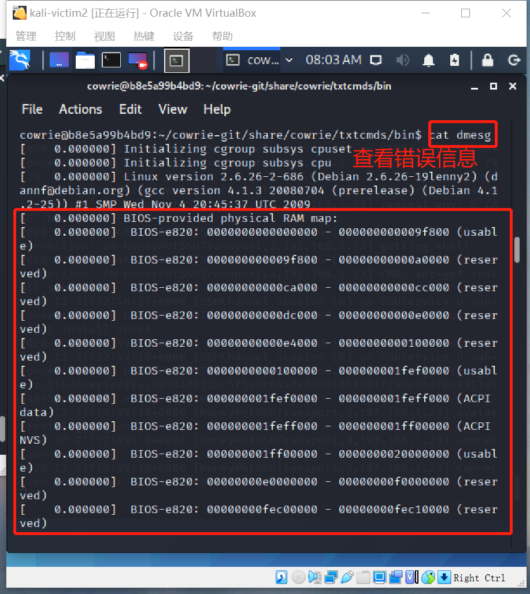
### Canarytokens
- honeytokens是可以“以快速的，便捷的方式帮助防御方发现他们已经被攻击了的客观事实”。为了实现这个目标，我们可以使用Canarytokens应用来生成token,当入侵者访问或者使用由Canarytokens应用生成的honeytoken时，该工具将会通过邮件通知我们，并附带异常事件的细节说明。
- 开始配置，先克隆仓库，并进入目录文件
```
git clone https://github.com/thinkst/canarytokens-docker
cd canarytokens-docker
```
- 安装docker-compose
```
$ sudo apt-get install python3-pip python-dev 
$ sudo pip install -U docker-compose
```
- 修改配置文件frontend.env
```
#These domains are used for general purpose tokens
CANARY_DOMAINS=proshare.net ##google免费域名

#These domains are only used for PDF tokens
CANARY_NXDOMAINS=proshare.net

#Requires a Google API key to generate incident map on history page
#CANARY_GOOGLE_API_KEY=
```

- switchboard.env
```
#CANARY_MAILGUN_DOMAIN_NAME=x.y
#CANARY_MAILGUN_API_KEY=zzzzzzzzzz
#CANARY_MANDRILL_API_KEY=
#CANARY_SENDGRID_API_KEY=
CANARY_PUBLIC_IP=162.243.117.221
CANARY_PUBLIC_DOMAIN=proshare.net
CANARY_ALERT_EMAIL_FROM_ADDRESS=noreply@example.com  #my_email_address
CANARY_ALERT_EMAIL_FROM_DISPLAY="Example Canarytokens"
CANARY_ALERT_EMAIL_SUBJECT="Canarytoken"
```
- 下载并启动图像
``` docker-compose up```
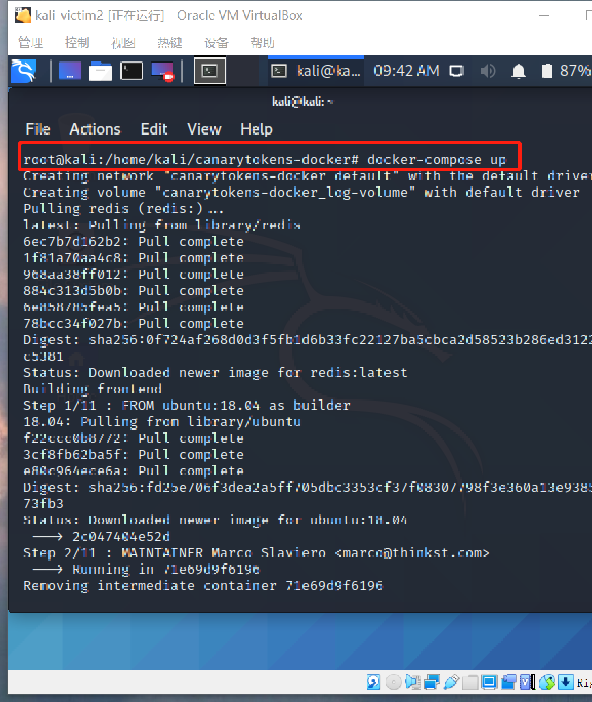

### 蜜罐的识别和检测方法
- 一些指令的错误报的错是由某些语言编写的代码，例如python的报错即可以判断出蜜罐的存在；
- 在安装包的时候我们也发现了蜜罐与普通真机的不同，通过这个也能初步判断“陷入”了蜜罐的陷阱中;
- 在进行ssh连接时，发现任意密码都能登录，这也是暴露点之一；
- 数据包时间戳分析：TCP提供了一些直接反映底层服务器状态的信息。TCP时间戳选项被网络堆栈用于确定重传超时时间。
- 环境不真实导致穿帮:我们很容易就能知道进行物理机器应有的配置，版本号等信息，而搭建的蜜罐往往在这方面做的不够完善，容易露陷
## 实验所遇问题
- 在修改配置文件frontend.env和switchboard.env的时候发现其命名后面有.dist，不能成功启动，自己新建了两个env的文件。
- 中途ssh突然无法连接，百度之后问题得以解决
## 参考资料
- [参考师姐实验仓库](https://github.com/CUCCS/2019-NS-Public-chencwx/tree/ns_chap0x11/ns_chapter11)
- [ssh突然无法连接](https://developer.aliyun.com/article/604726)
- [cowrie](https://github.com/cowrie/cowrie)
- [docker-ssh-honey](https://github.com/random-robbie/docker-ssh-honey)
- [ssh-honeypot](https://kalilinuxtutorials.com/kippo-honeypot-brute-force-attacks/)